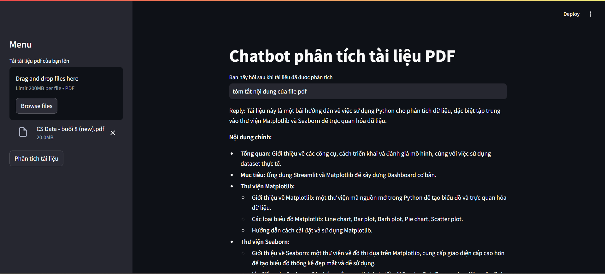

# 📚 AI Chatbot Project with Google Gemini & PDF Support
This project builds an AI-powered chatbot using Google Gemini (Generative AI) to answer user questions based on the content of uploaded PDF documents.

# 🧩 Key Components
### 🖥️ Web Interface: Built with Streamlit for a simple and fast user experience.

### 📄 PDF Document Processing:

Reads PDF files.

Splits text into smaller chunks for efficient processing.

### 🧠 Text Embedding with Google AI:

Converts text chunks into vector embeddings to capture semantic meaning.

### 📦 Vector Storage & Search using FAISS:

Stores embeddings in a FAISS index.

Retrieves relevant chunks based on user queries.

### 🤖 Smart Answer Generation with Google Gemini:

Uses Gemini to generate context-aware answers from the PDF content.

### 🔐 Secret Configuration Management:

Handles API keys and environment variables securely using a .env file (excluded from GitHub).

# ✅ Use Cases
Document-based AI chatbot for businesses or internal teams.

Smart assistants for technical documentation or contract review.

AI reading companion for books or research papers.

### chạy code bên dưới trong terminal để cài tất cả thư viên cần thiết cho dự án
pip install -r requirements.txt

### 🖥️ 1. import streamlit as st
Thư viện tạo giao diện web đơn giản cho ứng dụng Python (dùng nhiều trong AI, Data).

Ví dụ: tạo nút bấm, upload file, hiển thị kết quả AI.

### 📄 2. from langchain_community.document_loaders import PyPDFLoader
Dùng để đọc nội dung file PDF và trích xuất văn bản ra từng trang.

### ✂️ 3. from langchain.text_splitter import RecursiveCharacterTextSplitter
Dùng để cắt nhỏ văn bản dài (như tài liệu PDF) thành các đoạn ngắn để AI xử lý dễ hơn.

### 📂 4. import os và import tempfile
os: thao tác với hệ điều hành như tạo thư mục, đường dẫn file.

tempfile: tạo file tạm thời để xử lý rồi tự xóa sau khi dùng xong.

### 🧠 5. from langchain_google_genai import GoogleGenerativeAIEmbeddings
Dùng embeddings của Google để biến văn bản thành số (vector) phục vụ tìm kiếm thông minh.

### 🤖 6. import google.generativeai as genai
Thư viện chính của Google Generative AI (Gemini) – dùng để tạo văn bản, trả lời, v.v.

### 📚 7. from langchain_community.vectorstores import FAISS
Dùng để lưu và tìm kiếm các vector (từ embeddings), rất nhanh, rất phù hợp với chatbot tài liệu.

### 💬 8. from langchain_google_genai import ChatGoogleGenerativeAI
Dùng Google Gemini như một chatbot để tạo ra câu trả lời thông minh.

### ❓ 9. from langchain.chains.question_answering import load_qa_chain
Dùng để tạo chuỗi xử lý Q&A (truy xuất tài liệu → tạo câu trả lời).

### 📝 10. from langchain.prompts import PromptTemplate
Cho phép bạn tạo mẫu câu hỏi (prompt) cho AI – kiểm soát câu trả lời sinh ra.

### 🔐 11. from dotenv import load_dotenv
Dùng để tải các biến môi trường từ file .env, như API key, cấu hình bí mật.